<!-- Header Section (Intro & Whoami Terminal) -->

  

<!-- Highlights Section -->

  

<!-- Social Badges Section -->

  
  
  
  

 

<!-- Tech Stack Section -->

  

<!-- GitHub Live Stats Section -->

  
  &nbsp;&nbsp;
  

  

  

<!-- Footer Section (Contact & Exit Terminal) -->

  

<!-- Visitor Counter -->

  

