<div align="center">




</div>

## `$ whoami`

```bash
name="Kumar R Shet"
role="AI/ML Engineer | ML Researcher | Open Source Enthusiast"
focus=("scalable AI systems" "ML inference optimization" "production ML deployments")
location="Bengaluru, India"
```

## `$ cat highlights.log`

```txt
[ok] AWS Student Builder Group On-Campus Leader
[ok] Multiple Inter-College Technical Event Winner
[ok] Open Source and AI Research Enthusiast
[ok] Ex AI/ML Research Intern at IISC
```

## `$ connect --socials`

[](https://instagram.com/kumarr_shet)
[](https://www.linkedin.com/in/kumar-r-shet-4712552a1/)
[](https://x.com/KumarShet192579)
[](mailto:kumarrshet701@gmail.com)

## `$ stack --list`

```txt
Languages     Python, TypeScript, JavaScript, Java, C++, Bash
AI/ML         PyTorch, TensorFlow, Keras, scikit-learn, NumPy, Pandas, SciPy, MLflow
Cloud/DevOps  AWS, Google Cloud, Firebase, Render, Vercel, Heroku, GitHub Actions
Backend/Data  Django, Streamlit, Airflow, Cassandra, DynamoDB, MySQL, MongoDB, Postgres, Redis, SQLite, Supabase
Tools         Git, GitHub, GitLab, Figma, Framer, Anaconda, CUDA
```

## `$ gh stats --live`

<p align="center">
  
  <br />
  
  <br />
  
</p>

## `$ trophy --github`

<p align="center">
  
</p>

## `$ top-repos --contributed`

<p align="center">
  
</p>

<div align="center">


[](https://visitcount.itsvg.in)

</div>
